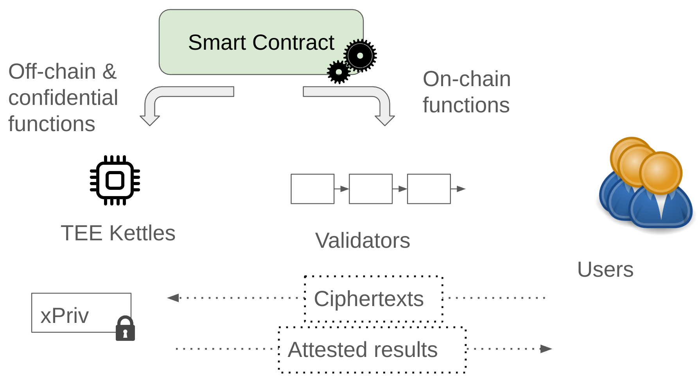
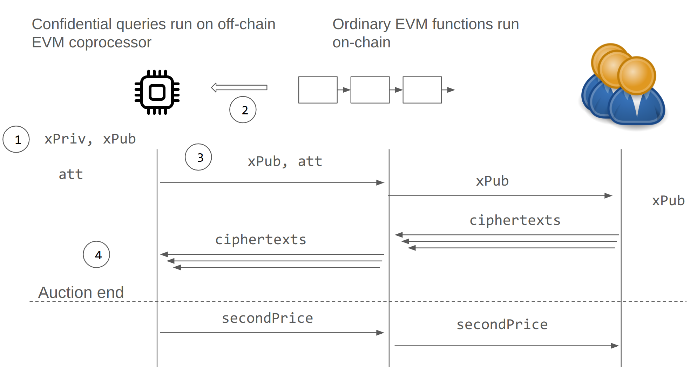
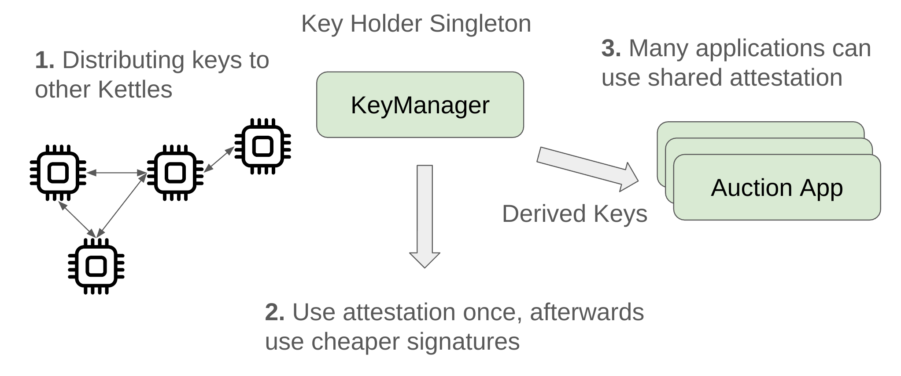

This post presents Sirrah, a minimalist demo of extending a blockchain with confidential computing using Trusted Execution Environments (TEEs). We'll cover the development end-to-end: starting from Gramine-SGX and ordinary REVM, and ending with MEV-aware auction application... and a timelock encryption demo that you [can try right now](http://timelock.sirrah.suave.flashbots.net:5173/).

<!--truncate-->

*Authors: Andrew Miller, Mateusz Morusiewicz, Frieder Paape. Special thanks to Brock Smedley for the Timelock Demo webapp, and Hasu and Jonathan Passerat-Palmbach for editing.*


## What is a TEE Coprocessor, did you just make that up?
For our purposes, a TEE coprocessor is a system that runs adjacent to an ordinary blockchain, and extends that blockchain's smart contract environment with TEE-based secure computing.


By the end of the post, the functionality we’ll end up with is similar to Secret Network and other TEE-based smart contracts like Oasis, Phala, Obscuro, as well as earlier research papers like [Ekiden](https://arxiv.org/pdf/1804.05141.pdf) and [State for the Stateless](https://eprint.iacr.org/2017/201). All of these share the same high level design: take an ordinary blockchain, but make the smart contract VM run inside a TEE. Now you have a smart contract system with confidentiality of some kind. There’s actually a [Systemization of Knowledge paper](https://arxiv.org/abs/2203.08548) including 20+ variations of this throughout academia and industry.

However, the path we take to add TEE to smart contracts is different than all these related projects. Specifically our codebase is simpler, because as much as possible is done in Solidity itself, and because we attach to an existing entirely unmodified blockchain.

### Illuminating the TEE Coprocessor with a minimalist speedrun
The design approach we take is optimized for *observability*. Nearly everything is written in Solidity. You'll see that we only modify a tiny bit of Rust code in the REVM crate, and the rest is just smart contracts. We want to have the trusted compute base be Solidity as much as possible to promote visibility. Actually, these precompiles expose a whole SGX framework to the Solidity developer, with local private storage and remote attestation.

What we are going to do is add some extra precompiles to extend the ordinary EVM. These precompiles won't actually be recognized by validators and clients of the underlying blockchain itself. It will look like a contract with a bunch of useless view functions that fail. However, these precompiles will be meaningful to TEE nodes running SGX enclaves, called Kettles... these are the compute nodes that actually carry out the computation of the "coprocessor" system as a whole.

### Smart contract programming with the Sirrah coprocessor




The fun payoff of this post is going to be writing an elegant application demo to run on the coprocessor. Before we get to the main challenge of building the coprocessor, let's start off with a taste of the programming model we want to end up with.

In our applications, the smart contract instance will be associated with a public key, tracked on-chain in plaintext:
```solidity
    bytes public xPub;
```

Users can use this key to encrypt confidential data for the coprocessor. Our application methods running in the TEE coprocessor will need to be able to access the corresponding private key to decrypt it:
```solidity
    // only available to off-chain TEE coprocessor
    function xPriv() internal coprocessor returns(bytes32);
```

When run on the ordinary EVM, `xPriv()` will simply revert. But when run in the TEE `coprocessor`, it will return the appropriate key. With these keys, users can transmit confidential data so that only the application can access them from a TEE coprocessor.


### Motivating example: MEV-Aware 2nd Price Auction
Let's introduce the motivating example of what problem a TEE coprocessor solves. We start with a second price auction written in Solidity. Bids can be submitted up to a hardcoded deadline. After the deadline, anyone can finalize the auction, computing the second price based on all the available bids. Simple, right?

```solidity
contract LeakyAuction is AuctionBase {

  mapping (address => uint) public balance;
  uint public constant auctionEndTime = /* deadline */;
  uint public secondPrice;
  mapping (address => uint) public bids;
  address[] public bidders;

  // Accept a bid in plaintext
  event BidPlaced(address sender, uint bid);
  function submitBid(uint bid) public virtual {
    require(block.number <= auctionEndTime);
    require(bids[msg.sender] == 0);
    bids[msg.sender] = bid;
    bidders.push(msg.sender);
    emit BidPlaced(msg.sender, bid);
  }

  // Wrap up the auction and compute the 2nd price
  event Concluded(uint secondPrice);
  function conclude() public {
    require(block.number > auctionEndTime);
    require(secondPrice == 0);
    // Compute the second price
    uint best   = 0;
    for (uint i = 0; i < bidders.length; i++) {
      uint bid = bids[bidders[i]];
      if (bid > best) {
        secondPrice = best; best = bid;
      } else if (bid > secondPrice) {
        secondPrice = bid;
      }
    }
    emit Concluded(secondPrice);
  }
}
```

The main problem here is pre-trade privacy. Bids are in plaintext, so the "Second Price" aspect is not at all secure against front running. Whoever goes last can influence the outcome price, griefing the winner. Put another way, the point of privacy in a second price auction is to prevent shill bidding... we don't want the auctioneer peeking at the winner's bid and raising the price to $1 below their offer.

Now, if we had a TEE coprocessor, we could extend our smart contract to use some extra features.
Instead of plaintext orders, the client can submit encrypted orders to the `xPub` public key:

```solidity
contract SealedBidAuction is AuctionBase, ... {
    ...
    mapping(address => bytes) encBids;
    function submitEncrypted(bytes memory ciphertext) public {
        require(block.number <= auctionEndTime);
        require(encBids[msg.sender].length == 0);
        encBids[msg.sender] = ciphertext;
        bidders.push(msg.sender);
    }
}
```

In the code repository we include an example encryption function, written in Solidity mainly so we can invoke it with foundry tools like `cast`. But don't be confused, the point is for this to be evaluated locally by the client. The parameter `r` must be generated randomly by the client.
```solidity
   function encryptBid(uint bid, bytes32 r) public view returns(bytes memory ciphertext) {
        return PKE.encrypt(xPub, r, abi.encodePacked(bid));
    }
```

To finish the sketch of our auction application, we have to implement the `finalize()` routine. This is the public method that runs only in the TEE coprocessor, hence the `coprocessor`annotation. The coprocessor decrypts each encrypted bid and computes the second price auction solution.

```solidity
function finalize() public coprocessor {
  require(block.number > auctionEndTime);
  uint secondPrice_;
  for (uint i = 0; i < ciphertexts.length; i++) {
  uint bid = PKE.decrypt(xPriv(), ciphertexts[i]);
  ... // compute secondPrice_
  applyOnchain(secondPrice_) {
  	secondPrice = secondPrice_;
	emit Concluded(secondPrice);
  }
}
 ```

The most whimsical feature here is the `applyOnchain` codeblock. The idea is that the `finalize` method in the coprocessor invokes an eventual update to the auction's state on-chain. We'll end up implementing this across several methods.

We've seen enough of the coprocessor programming model to know where we're headed. Now let's dive into how to implement this using TEEs.

## How do you build a TEE coprocessor?
Here’s an outline of the steps we'll take to implement the auction application described above:

1. **Run REVM in an enclave.** The basic implementation is a fork of REVM that can run in an SGX enclave. We use the Gramine framework, but other frameworks like Oclum or Fortanix would work about as well. We will include several additional precompiles that we need to build the coprocessor. Specifically we need the ability to generate and store the private key `xPriv`.

2. **Include a light client in the enclave.** We have to ensure the TEE coprocessor only executes EVM in a valid context corresponding to the actual blockchain state. We are using the Helios light client running in Gramine, and adapted to handle Proof-of-Authority (rather than Proof-of-Stake).

3. **Add remote attestation to Solidity.** We need to use the remote attestation feature of TEE so that our smart contracts can verify that a message came from a TEE.  To do this, we add a new precompile so that Solidity code is allowed to generate a remote attestation. It's a bit like Gramine for Solidity, since we are exposing a fairly low level interface directly to the smart contract environment. While generating an attestation requires an SGX processor, verifying the attestation occurs entirely on-chain. The remote attestation is just a certificate chain, and the verifier is written in Solidity. We specifically use the [Automata-V3-DCAP](https://github.com/automata-network/automata-dcap-v3-attestation) repository, which is an open source Solidity library for verifying these.

4. **Finish the Auction Application.** We’ll finish out the application by writing Solidity code to finalize the auction, carrying out the decryption on the TEE coprocessor and writing the response back on-chain.



We’ll next go through each of these steps in more detail.

## 1. Running EVM in a TEE

### What’s a Trusted Execution Environment (TEE)?
A TEE is an isolated process environment. It's a feature supported by many Intel and AMD processors. Basically it defines a new process type, an enclave process, that runs at an extra isolated level. Even the operating system kernel or hypervisor cannot inspect or tamper with the enclave process. This is the basis for using TEEs for secure computing. Read more about enclaves [(a)](https://writings.flashbots.net/block-building-inside-sgx) [(forum)](https://collective.flashbots.net/tag/sgx)

The most important TEE feature we use is remote attestation. This means the TEE can produce a chain of certificates signed by the root of trust (the manufacturer, Intel). You can verify this certificate to check if a given message was actually produced by a TEE. We'll come back to this later.


### What’s Gramine?
Gramine is the framework we use for adapting existing code to run in an SGX enclave.
Really it does two things. The first is that it can package up all the binaries of the dependencies into a single root hash.
Specifically this is a “manifest file,” and with Gramine you basically point it to copy any of the built dependencies and system libraries. Comes with examples for Rust.
Practically this involves a Gramine script that traverses the system dependencies, pinning their versions and binary hashes in lock file, similar to what Cargo.lock achieves.
Ideally we would have reproducible builds for the entire stack, but the bottleneck right now is relying on a published “dockerhub” image from Gramine with all the system libraries pre-established.

The second thing Gramine does is provide a `libOS`. This means that every *system call* in the enclave replaced with a Gramine definition, which typically must pass control to the *untrusted* OS. Later on we'll mainly use Gramine features provided through the filesystem.

### What’s involved in making an existing codebase like REVM run in Gramine?
REVM is simple due to not having many dependencies.
We've seen a minimalist example of [REVM running in an enclave](https://github.com/gakonst/sgx-revm) from Georgios, and several following in a [twitter thread](https://twitter.com/gakonst/status/1697787062005731345). Before we can do anything interesting, we will have to enable access to a source of randomness. We do this by adding additional opcodes, called “precompiles”, to our fork of the EVM.

### Key generation and storage precompiles
To generate a key, our coprocessor will need to do the following in Solidity:
```solidity
   function Suave.localRandom() internal coprocessor returns (bytes32);
```

Extending REVM with additional precompiles is not very difficult. Here’s an excerpt from its implementation in [`sgx_attest.rs`](https://github.com/flashbots/suave-andromeda-revm/blob/main/src/precompiles/sgxattest.rs). Note the hardcoded addresses (no real convention around these, but we should try to avoid conflict) and the hardcoded gas cost.

```rust
pub const RANDOM: PrecompileWithAddress = PrecompileWithAddress(
    u64_to_address(0x40703),
    Precompile::Standard(sgxattest_random as StandardPrecompileFn),
);
fn sgxattest_random(input: &[u8], gas_limit: u64) -> PrecompileResult {
    let gas_used = 10000 as u64;
    if gas_used > gas_limit {
        return Err(Error::OutOfGas);
    } else {
	let mut file = std::fs::File::open("/dev/urandom").unwrap();
	let mut buffer = [0; 32];
	file.read(&mut buffer[..]).unwrap();
	return Ok((gas_used, buffer.to_vec()))
    }
}
```

We also need to store the key, persisting it locally.
```rust
    function Suave.volatileSet(bytes32 tag, bytes32 value) external coprocessor;
    function Suave.volatileGet(bytes32 tag) external coprocessor returns(bytes32);
```

To do this, we can just do it in RAM, using a static reference variable containing a Hashmap. The address of the contract that calls this precompile, `caller`, is used as a domain separator. In this way, each contract gets its own isolated storage in the coprocessor. We’ll just show the main excerpt from `sgxattesta_volatile_set`.

```rust
fn sgxattest_volatile_set(input: &[u8], gas_limit: u64, env: &Env) -> PrecompileResult {
	...
	let mut vol = volatile.lock().unwrap();
	let domain_sep = env.msg.caller;
	let mut key : [u8;52] = [0; 52];
	key[ 0..20].copy_from_slice(&domain_sep.0.0);
	key[20..52].copy_from_slice(&input[0..32]);
	let mut val: [u8; 32] = [0; 32];
        val.copy_from_slice(&input[32..64]);
	vol.insert(key, val);
	return Ok((gas_used, vec![]))
}
```

Note that this means the precompile has a side effect on the coprocessor. Although `coprocessor` blocks are like `views` in that they do not have side effects on the on-chain state, they still modify the local storage of the coprocessor. This is volatile storage in the sense that it is persistent between calls, but it’s limited to the lifetime of this process.

A final mechanism we expose is sealing keys. These are persistent keys that persist even if the TEE process restarts. The sealed key will be the same. It is bound to the particular CPU, and to the particular enclave. In our implementation, a unique sealing key is derived for each *caller*.


## 2. Light Client in an TEE

It is imperative to ensure that the TEE coprocessor only executes the EVM within a valid context aligned with the current blockchain state. This ensures execution integrity and thwarts potential attacks, such as kettle operators attempting to extract confidential data by modifying this state.
While running a full node in SGX is feasible, it requires a large amount of storage and contradicts our objective to minimize the TCB. As an alternative to this approach we want to use an implementation of ethereums light client protocol to gain access to verified state while only requiring a small TCB footprint and no storage.
Instead of downloading every block, light clients only download block headers. These headers contain summary information about the contents of the blocks. Any other information the light client requires gets requested from a full node. The light client can then independently verify the data they receive against the state roots in the block headers.


How does Helios provide valid state for the TEE Coprocessor?
Helios is a fully trustless, efficient, and portable Ethereum light client written in Rust and also built upon REVM. It converts an untrusted centralized RPC provider into a verifiably safe, local RPC. Running Helios within SGX using Gramine gives us access to a trusted source of state via RPC.
However we would like to reduce the TCB even more, which is possible by embedding Helios as a client library within the kettle. In our implementation, the execution layer delivers state information to REVM through a Remote State DB. This database implementation hooks into Helios Methods to fetch the necessary execution states and verifies them in real-time using Merkle proofs.
In contrast to the Helios consensus, Sirrah is designed for the Clique Proof-of-Authority consensus protocol rather than Proof-of-Stake. Whereas the execution layer builds on Helios, for PoA we provide a simplified light client consensus layer implementation, eliminating voting and signer limits. This results in a consensus process where we make aggressive assumptions about the PoA blocks produced meaning only block signatures undergo verification and each validator must be fully trusted. With such assumptions there is no added value in checking the block header history. For syncing we just fetch the latest block header from the untrusted RPC.
While it was easy to import Helios execution layer verification methods into the kettle to do real-time verification of state, this also means we are still depending on a large part of Helios which is not required to run within SGX, namely all code which uses (asynchronous) network communication. To make this code work in Gramine, we had to enable the "insecure" eventfd system and switch to multi-threaded execution. It is possible that this exposes additional attack surfaces which is why in a future version we want to limit the kettles exposure to Helios to only the verification logic, providing it with pre-fetched state and verification proofs for each transaction.

## 3. Adding Remote Attestation to Solidity
We’ve used the enclave to generate decryption keys. How can we be sure that we have a public key that was in fact generated this way?

This is where remote attestation comes in.
```solidity
 function Suave.attestSgx(bytes32 appData) external coprocessor returns (bytes memory att);
 function Suave.verifySgx(address caller, bytes32 appData, bytes memory att) public view returns (bool);
```

When this is run in the TEE environment, it will output an attestation `att` that can be verified by the corresponding verify function.
Specifically if `Suave.attestSgx(appData)` is invoked by a contract with address `addr`, we can pass this to  `Suave.verifySgx(addr, appData, att)` and it will check out... but the only way to produce passing attestations is by running the appropriate enclave process on a properly configured SGX.

We are basically exposing remote attestation at a fairly low level to the smart contract environment. Pretty much the only restriction we've designed in is the use of the smart contract address of the `caller` as a domain separator. This means that a contract can only generate an attestation that verifies under it's own address. In this way contracts are isolated from spoofing each other’s attestations.

All the new precompiles are implemented in [under 200 lines of rust.](https://github.com/flashbots/suave-andromeda-revm/blob/main/src/precompiles/sgxattest.rs)

Here is the entire implementation of the remote attestation precompile:
```rust
fn sgxattest_run(input: &[u8], gas_limit: u64, env: &Env) -> PrecompileResult {
    let gas_used = 10000 as u64;
    if gas_used > gas_limit {
        return Err(Error::OutOfGas);
    } else {
        // Write some user report data
        let mut f = match File::create("/dev/attestation/user_report_data")?;
	// User report data = Hash( Caller || Application input)
	let domain_sep = env.msg.caller;
	let message : &[u8] = &ethers_core::abi::encode(&[Token::Address(H160(domain_sep.0.0)),
							  Token::Bytes(input.to_vec())]);
        let hash = sha2::Sha256::digest(message).to_vec();
        f.write_all(&hash)?;
        let quote = fs::read("/dev/attestation/quote")?;
        return Ok((gas_used, quote))
    }
}
```

### How do Gramine and Fortanix provide remote attestation?
This example uses Gramine, so we’ll explain how remote attestation works there. At the low level, this involves using SGX opcodes in extended x86, in order to activate a fixed SGX process called the quoting enclave, which inspects our enclave and returns the signed report. Gramine exposes these through a convenient interface: pseudo device files, specifically `/dev/attestation/quote` and `/dev/attestation/user_report_data`. From the viewpoint of a Gramine application, writing to the `user_report_data` is how we set up the application defined data, and reading from `/dev/attestation/quote` provides the result. Fortanix provides library functions to achieve a similar effect.

### Bootstrapping a key
We can now put together these components together and initialize the contract, generating the private key in the Kettle.
```solidity
    function offchain_Bootstrap() public
    returns(bytes memory _xPub, bytes memory att) {
	bytes32 xPriv_ = Sirrah.localRandom();
	_xPub = PKE.derivePubKey(xPriv_);
	Sirrah.volatileSet("xPriv", xPriv_);
	att = Sirrah.attestSgx("xPub", keccak256(_xPub));
    }
```

In the next step we’ll have to verify this on-chain.

### On-chain verification of Remote Attestations
So far we have described how to bootstrap a key and generate key off-chain. Verifying attestations is the next task. This doesn’t require anything special from the EVM, just some good old-fashioned Solidity coding. Here’s a [(forum post)](https://collective.flashbots.net/t/demystifying-remote-attestation-by-taking-it-on-chain/2629/2) about two projects, RAVE from Pu ffer Finance, and Automata-DCAP-v3-Attestation that do this. There’s even a [contest](https://github.com/amiller/sgx-epid-contest/) to illustrate how verification of EPID transactions work.

// The main thing we do is make a development environment that separates “verifying” attestations from creating them. Basically we are running a webservice, Attestations on Demand, that let you configure the 64-byte user data to whatever you want. Basically this is a convenient way of generating realistic test cases for the verifier, without actually having to run your own SGX node.

Here's an excerpt from the key manager code to install the public key:
```solidity
    function onchain_Bootstrap(bytes memory _xPub, bytes memory att) public {
        require(xPub.length == 0); // only install once
        Suave.verifySgx(address(this), keccak256(abi.encodePacked("xPub", _xPub)), att);
        xPub = _xPub;
    }
```

## 4. Finishing Auction Application

Finally we can finish the auction application. And actually it’s not much more than what we’ve already covered. At this point our contract has a public key, and the TEE coprocessor has locally stored its private key. We have already described how a user can encrypt the records given the public key, and we have already defined a function for computing the result. So our auction just needs to have one more off-chain function for decrypting the result, and writing back the response on chain.

Since we hadn’t specified it earlier, for the key derivation and decryption we are specifically using the `alt_bn128` elliptic curve, the one that EVM already supports with `ecMul` and `ecAdd` precompiles.

```solidity
    // Called by any kettle to compute the second price
    function offline_Finalize() public returns (uint256 secondPrice_, bytes memory att) {
        require(block.number > auctionEndTime);
        bytes32 xPriv = xPriv();

        // Decrypt each bid and compute second price
        uint256 best = 0;
        for (uint256 i = 0; i < bidders.length; i++) {
            bytes memory ciphertext = encBids[bidders[i]];
            uint256 bid = abi.decode(PKE.decrypt(xPriv, ciphertext), (uint256));
            if (bid > best) {
                secondPrice_ = best;
                best = bid;
            } else if (bid > secondPrice_) {
                secondPrice_ = bid;
            }
        }

        // Use the key manager attest
        att = Suave.attestSgx(keccak256(abi.encodePacked("2ndprice", secondPrice_)));
    }
 ```

And finally here's the application method that verifies the attestation on the auction result and stores the result.
```solidity
function onchain_Finalize(uint256 secondPrice_, bytes memory att) public {
  require(block.number > auctionEndTime);
  Suave.verifySgx(address(this), keccak256(abi.encodePacked("2ndprice", secondPrice_)), att);
  secondPrice = secondPrice_;
  emit Concluded(secondPrice);
}
```

This concludes the speedrun! An end-to-end auction demo using TEE for privacy.

Let’s count the lines of code:
- `SpeedrunAuction.sol`: 139 lines
	Can you believe it? This is pretty much the entire application, including the bootstrapping the auction logic itself.
- `Andromeda.sol`: 61 lines Just type annotations around the precompile “STATICCALL”s
- `suave-andromeda-revm/src/precompiles/sgxattest.rs` 185 lines  for the implementation of the precompiles themselves
- `Encryption.sol`: 87 lines  Just a wrapper around the alt_bn128 library for encryption
- `DcapVerifier.sol`: 32 lines to adapt automata (not counting the Automata dependency)
- Helios: `suave-andromeda-revm/src/consensus.rs` 128 lines to adapt this from PoS to PoA for testnets.
- `suave-andromeda-revm/src/*.rs`: around 1000 lines for handling RPC from the untrusted host, passing storage from the light client to the EVM execution environment after verifying merkle storage proofs.

## Improving Key Management
We finished the MVP demo, but the code repository contains a little bit more demonstration of the “payoff” of doing everything in Solidity for so much of the system. We can now improve the key manager process just by modifying the Solidity code. Basically we provide a module that is roughly similar to how Secret Network handles keys for different contracts across multiple SGX compute nodes. It has the following features:
A key is bootstrapped initially by a single node, but thereafter it is shared to other SGX nodes that join the network.
Remote attestation is expensive on-chain, so we only do it once when a new node registers. Subsequent “signed messages” from that node can just use inexpensive digital signatures, the on-chain registry basically maps addresses to the attestation collected previously.
Furthermore many applications can share the same key distribution. Each application gets access to its own hardened derived key, just like bitcoin wallet derivation.
Here’s a high level depiction:



This improved Key Manager is provided just as a starting point for illustration. The next SUAVE milestone will have a more appropriate design.

## Security considerations
We haven’t discussed in detail the security model. The first thing we can say is about confidentiality guarantees. We can also look at the backup guarantees when the SGX fails. Finally we can try to limit damages if people collude.

### Backup guarantees if the SGX experiences a vulnerability.
We also have to cover issues like key rotation, defining and enforcing governance policies on the acceptable mrenclaves, and more.
It may sound like a tough task, but Solidity is actually fairly efficient for all that’s involved here - validating certificates and expressing/enforcing an access control policy are a good fit for solidity. And EVM is a fairly portable implementation. Additionally since smart contracts draw the attention of auditors, this is a good way of putting the critical code where auditors will look at it most carefully.

### Providing an Explicit Privacy Model

Our threat model is an *analysis oriented Kettle operator* that runs a modified version of everything except the enclave, and is trying to leak as much alpha from observing the MEVM execution as possible. We mentioned the point of our example is to keep the bids sealed. But what actually else is leaked during EVM execution?

Actually, many operations like SHA3 have a fundamentally variable amount of data they process… this in particular operates on a variable length string read from “memory”. It’s charged gas accordingly too, the gas gost being 30 gas + 6 gas for each word (rounded up). We could redact the gas used counter…. but the more important thing is the actual size of the data is only limited by the max gas parameter of the transaction. We can’t “Pad” every SHA3 to this max possible size.

Another issue is access pattern leakage. Actually, many operations like SLOAD and SSTORE introduce a potential hazard. This is because the total storage size of a contract can be greater than fits on the processor itself. (For example, there are around 5 million accounts in a “balances” [mapping on the USDT token](https://etherscan.io/token/0xdac17f958d2ee523a2206206994597c13d831ec7#balances). That’s a 160 megabyte mapping of just 20-byte addresses and 32-byte balances). This requires the use of memory paging, and with SGX that is still under the control of the untrusted operating system. Actually to understand how this works in SGX, you should try to learn about running SGX-Step, like how a pro side channel h4x0r would be running a kettle in an analysis harness.

Rather than try to mitigate this, for now we will start by being explicit about marking what we think is leaked. Our approach will be the following: we provide an extension of the MEVM that provides a “Leakage Model Trace”, or a “Redacted Debug Trace.” This is implemented conveniently using the “Inspector” abstraction in REVM. (It’s a convenient way of attaching a “visitor” to every opcode during execution). This is a [work in progress](https://github.com/flashbots/revm-andromeda/commit/aff1dd988f0502ef3688bd5291ef8ec8060c5144). Here is a sample of this output is provided below:

```
...
depth:1, PC:3513, gas:XXX(XXX), OPCODE: "SWAP1"(144)  refund:XXX(XXX) Stack Size:6, Data size:96
depth:1, PC:3514, gas:XXX(XXX), OPCODE: "SWAP2"(145)  refund:XXX(XXX) Stack Size:6, Data size:96
depth:1, PC:3515, gas:XXX(XXX), OPCODE: "AND"(22)  refund:XXX(XXX) Stack Size:6, Data size:96
depth:1, PC:3516, gas:XXX(XXX), OPCODE: "SWAP2"(145)  refund:XXX(XXX) Stack Size:5, Data size:96
depth:1, PC:3517, gas:XXX(XXX), OPCODE: "PUSH29"(124)  refund:XXX(XXX) Stack Size:5, Data size:96
...
```


You can see that it provides a detailed trace of the program counter and which opcode is executing at each step, as well as a partially redacted/sanitized version of the stack and memory. When an opcode like sha3 runs, this indicates how long the parameter is! And every time an MLOAD/MSTORE/SLOAD/SSTORE runs, we see the key that’s being fetched.

The idea is that this represents a conservative estimate of what we think a side channel analyst would be able to determine if they used SGX-Step to its full potential. This is meant to serve as documentation like in the form a cryptographer or savvy security auditor would expect to see, in the form of a leakage function you can apply anywhere MEVM would run.

# Timelock encryption demo

You can run the auction code in your own forge environment, or by deploying your own TEE if you're brave.
But for a bonus demo that everyone can play with right now, here's a bonus Timelock Encryption application.

This is inspired by the "Vigil.sol" application on Oasis (which is no coincidence, since it's a good illustration of the same programming model).

Basically the flow is similar to the auction, but instead of uploading an encrypted bid, you post an encrypted message to the blockchain to the public key associated with this `Timelock.sol` smart contract.
The contract lives on the Rigil testnet [https://explorer.rigil.suave.flashbots.net/address/0x685816...26dDD6](https://explorer.rigil.suave.flashbots.net/address/0x6858162E579DFC66a623AE1bA357d67BF026dDD6).
The encrypted message can only be decrypted by a TEE kettle, after the encrypted message is timestamped on-chain and a fixed duration passes (about one minute).
You can try it out with the [demo's front-end webapp](http://timelock.sirrah.suave.flashbots.net:5173/).
Note that you will need a web3 provider like Metamask, and to point it to [the Rigil testnet](https://github.com/flashbots/suave-specs/tree/main/specs/rigil), and probably visit the [Rigil faucet](https://faucet.rigil.suave.flashbots.net/).
