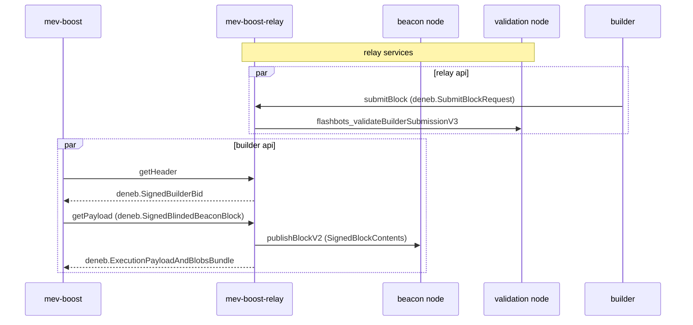
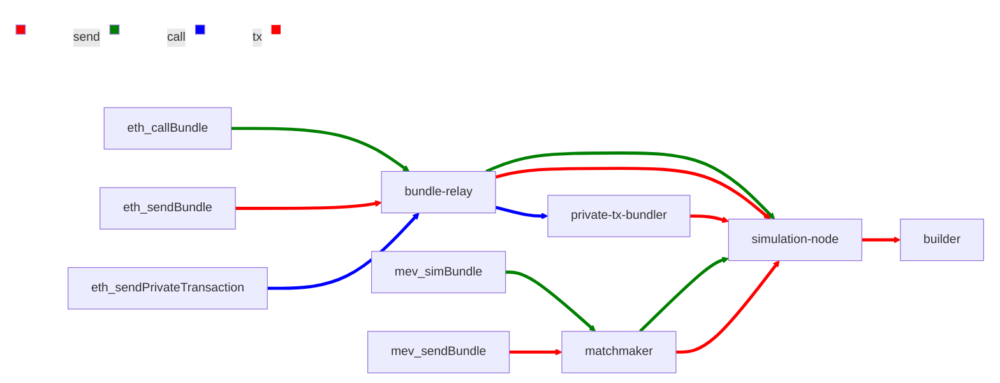

The Dencun fork is a major Ethereum upgrade planned for over 2 years and recently went live on March 13 at epoch 29696. This upgrade introduces blob transactions, designed to reduce transaction costs for rollups. This post will detail Flashbots’ engineering work in preparation for the upgrade.

<!--truncate-->

## Protocol Changes in Dencun for MEV-Boost

The Dencun fork consisted of multiple EIPs which required upgrades to the payloads passed through the mev-boost stack. 

The biggest protocol change is [EIP4844](https://eips.ethereum.org/EIPS/eip-4844), which introduces blob transactions for layer 2 data availability. Blob transactions are a new transaction type submitted and gossiped through the execution layer but stored in the consensus layer ephemerally.

Another change with implications for block building and validation is [EIP-4788](https://eips.ethereum.org/EIPS/eip-4788), which introduces the beacon block root to the execution layer.

## MEV-Boost Architecture

Both [mev-boost](https://github.com/flashbots/mev-boost) and [mev-boost-relay](https://github.com/flashbots/mev-boost-relay) needed to implement the latest [builder-specs](https://github.com/ethereum/builder-specs) APIs in order to be Dencun compatible. The [builder APIs](https://github.com/ethereum/builder-specs) specify how mev-boost communicates with external relays. Typically for every fork upgrade, the [getHeader](https://ethereum.github.io/builder-specs/#/Builder/getHeader) and [submitBlindedBlock](https://ethereum.github.io/builder-specs/#/Builder/submitBlindedBlock) types need to be updated to support new fields in the execution header and payload.

For mev-boost, this was achieved by switching to the attestant [go-eth2-client](https://github.com/attestantio/go-eth2-client) and [go-builder-client](https://github.com/attestantio/go-builder-client) libraries from the deprecated [go-boost-util](https://github.com/flashbots/go-boost-utils) types. The specs are often in flux leading up to testnet forks, and thus most of the work involved adding the new Dencun types in these libraries and iterating on changes to the spec.

Changes in the mev-boost-relay were more complex. In addition to builder-specs APIs, relays also need to implement changes to the [relay-spec](https://github.com/flashbots/relay-specs) APIs which specifies how builders communicate with the relay. To perform its block validation duties the relay also needed to be aware of the Dencun fork version and schedule, as well as upgrading its block publishing and block validation calls. 

### Block Validation

Block validation is done via the [block validation api](https://github.com/flashbots/builder/blob/main/eth/block-validation/api.go) to Flashbots’ [modified geth client](https://github.com/flashbots/builder). For Dencun, blob transactions coming from the execution layer meant that almost all blob validation are handled by the block validation api instead of at the relay. By pulling in upstream geth changes, existing geth code could be leveraged to validate blob transactions and blob header fields. 

Additionally, for [EIP-4788](https://eips.ethereum.org/EIPS/eip-4788), the relay needed to pass the parent beacon root to the block validation api.

The following sequence diagram describes the full interactions and updated endpoints for the upgrade.

## Block Building

Flashbots also operates a builder which is [modified from geth](https://github.com/flashbots/builder). In addition to block validation, block building logic needed to be updated to support private blob transactions and blob transactions in bundles. 

Geth significantly changed its `txpool` structure for 4844 by introducing subpools to handle the eviction strategies of legacy and blob transactions differently. However, this does not apply well to bundles as they have different validity conditions, such as the target block number the bundle is valid for. 

Instead of trying to conform to geth’s subpool interface, the most effective way to add bundle support was to have all bundle and [mev-share](https://docs.flashbots.net/flashbots-protect/mev-share) logic in the top level `txpool` instead of having to fetch bundle transactions from the subpools. This way, bundle logic is segregated from subpool logic and can be moved out to its own service instead of being integrated with geth’s `txpool`. There are potential optimizations to be made by taking into account the increased size of bundles with blobs during block building. However that was left as something to be considered after the hard fork due to time constraints.

As with block validation, the parent beacon root needed to be passed as block building arguments from the beacon node’s [payload_attributes sse stream](https://ethereum.github.io/beacon-APIs/#/Events/eventstream).

## JSON RPC Services

Flashbots run a variety of JSON RPC services for users and searchers to submit private transactions, bundles and mev-share bundles via Flashbots’ [JSON RPC endpoints](https://docs.flashbots.net/flashbots-auction/advanced/rpc-endpoint).

Most of the middleware for these services are written in Golang, a geth dependency update was sufficient to support the upgrade. Internally, Flashbots wraps all `eth_sendPrivateTransaction` calls into bundles and simulates all bundles before they are merged by the builder. The `eth_callBundle` and `mev_simBundle` methods could leverage existing geth code to simulate blob transactions since simulation logic share the same codebase as the builder.  

## Testing

One of the most difficult aspects is testing the entire stack due to the difficulty of configuring all the different services correctly. Some tooling used included:

### Kurtosis

[Kurtosis](https://www.kurtosis.com) provides tooling for launching containerized services and its [ethereum-package](https://github.com/kurtosis-tech/ethereum-package?tab=readme-ov-file#proposer-builder-separation-pbs-emulation) allows an Ethereum PoS devnet to be spun up locally in one command.

Flashbots collaborated with Kurtosis to incorporate PBS emulation into the ethereum package which was invaluable in testing the end-to-end flow for mev-boost locally. However some caveats when running the PBS emulation with Kurtosis:

- Setting up a local devnet is resource-intensive. Depending on the number of nodes configured it is hard to run multiple or long-running devnets on a single machine
- Waiting for the initial setup is slow. Some consensus clients don't request mev-boost for blocks until epoch 4, and the Flashbots builder does not have support for configurable slot times to shorten the wait for each epoch. Each run could take 20 - 30 minutes to test an end-to-end flow
- Hard to iterate on changes quickly. When a bug is found, the local devnet needs to be recreated with an updated docker image with the fix. This is not ideal due to the slowness of the initial setup, and there is an [open issue](https://github.com/kurtosis-tech/kurtosis/issues/2057) for the ability to update docker images while the devnet is running.

### Devnets and Shadow Forks

Devnets are publicly available testnets setup by the EF that typically run for a few weeks. Flashbots collaborated closely with Ethereum Foundation DevOps team to add mev-boost services in their infrastructure setup and testing.

Shadowforks are devnets that fork the state and replay transactions of an existing network such as mainnet. Mainnet shadow forks are crucial in building confidence in mev-boost releases, as we have no visibility into mev-boost errors on mainnet. The mev-boost software runs alongside validator clients, so the primary mechanism for identifying and mitigating bugs is direct input and reports from validators  

In total, Flashbots participated in every devnet since devnet-9 (of which there were 12 in total), 2 Goerli shadowforks and 1 mainnet shadowfork in the 5 months leading up to the hard fork.

### Testnets

The mev-boost stack is incorporated into many of the core Ethereum protocol testing infrastructure as it is crucial to the health of the network. Testnets come in handy to test bundle and private transaction endpoints as there are existing searchers submitting transactions on Sepolia and Holesky. 

Since the testnets are long-running, they can also catch bugs not caught in devnet or shadowfork testing. Some examples include:

- A [memory leak](https://github.com/flashbots/builder/pull/145/commits/992725ae9ac149533a2495fdab6deb873c6038c7) in instantiating workers during block building
- A [bug](https://github.com/flashbots/builder/pull/145/commits/5ac33b5a6cdd3be00bb300be1472aed7576e8abf) that corrupted the state trie when a contract self-destructs in the same transaction as it is created, causing the builder to be unable to sync

## Learnings and Future Steps

The Dencun fork was a great opportunity to review internal processes for upgrading and maintaining Flashbots’ key services and products. Some important takeaways in comparison with the last Shapella hard fork: 

- Importance of better tooling such as Kurtosis for local testing
- Early integration with Ethereum clients is key in resolving client bugs. As mev-boost testing occurred later during the testnet forks for Shapella, a client bug wasn’t discovered until mainnet, resulting in missed slots.
- Improved maturity of the mev-boost ecosystem. Client teams are more aware of mev-boost resulting in fewer last minute changes to accommodate external block building.

For things to improve on for future hard forks:

- Bundle and private transaction spammer tooling. Currently there is no tooling to send bundles with blob transactions and tools like [mev-flood](https://github.com/flashbots/mev-flood) only cover a minority of test cases
- Improving dev tooling in the builder. The builder was the hardest to test for Dencun due to the lack of modularity of the block building logic, configurable slot times and performance monitoring.

## Community Contributions

Delivering a smooth Dencun upgrade would not be possible without the help and involvement from the community:

- Review of the mev-boost and mev-boost-relay Dencun code from other mev-boost maintainers
- Bug reports from other relay operators such as Ultrasound and bloXroute
- mev-boost community calls discussing Dencun spec and progress updates

Special thanks to EF Devops, the Kurtosis team, mev-boost maintainers for reviewing and ensuring the Dencun upgrade went smoothly.